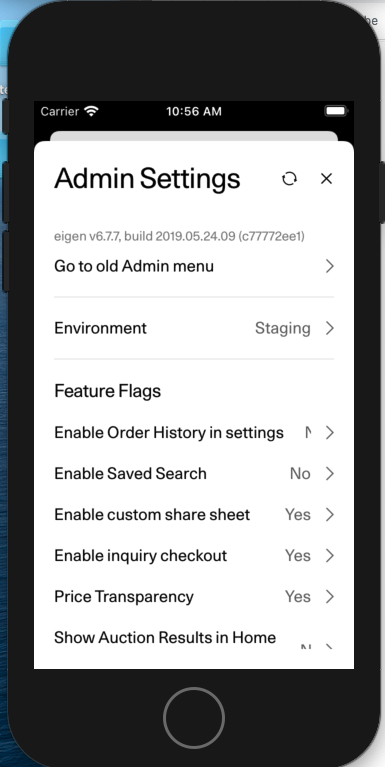
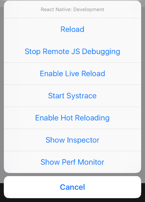

# Debugging

Eigen has two developer menus: The regular react-native In-App Developer Menu + An Admin Settings Menu.

## Admin Settings Menu

This is a custom menu that we use for all our in house built-in debugging features (clearing relay cache, throwing sentry errors, showing analytics events ...etc) in addition to enabling/disabling feature flags.



By default, this menu is disabled if you are running the app in a production build or if you are on staging in a non-artsy mail account. To enable it:

1. Run the app in the simulator or a real device.
   1a. Developer mode should be on in you are developing (`__DEV__` is true, or you are logged in with an artsy email). Make sure it is, by going to Profile > About. If "Version" has a one pixel purple line on the right, then you are good to go. If not, then you need to tap "Version" 7 times quickly, to enable developer mode.
2. Simulate a ‘shake’ event (<kbd>^⌘Z</kbd>), which will bring up the dev menu.

## In-App Developer Menu

You can access the developer menu by using the <kbd>⌘D</kbd> keyboard shortcut when your app is running in the iOS Simulator, or <kbd>⌘M</kbd> when running in an Android emulator on Mac OS and Ctrl+M on Windows and Linux.


## Breakpoints

To enable breakpoints, you need to **Start Remote JS Debugging** from the **In-App Developer menu**

### Dynamic

To set breakpoints from the Chrome Developer Tools, open the ‘Go to source’ menu (<kbd>⌘P</kbd>), search for the
file you’d like to set a breakpoint in, and set the breakpoint by clicking the gutter bar at the desired line.

### From code

In some situations that require very specific conditions, it’s easier to break by inserting an instruction in your code.
For this you can use the `debugger` keyword, e.g.

```ts
if (someCondition && anotherCondition) {
  debugger
}
```

### All exceptions

It’s possible to break on any thrown exception by selecting ‘Pause On Caught Exceptions’ from the ‘Sources’ tab.

## GraphQL queries

Relay will log debugging info for each query it performs in the ‘Console’ tab:


However, like any other networking, the raw request/response information can be made available from the ‘Network’ tab by
[enabling the Network Inspector](https://github.com/jhen0409/react-native-debugger/blob/master/docs/network-inspect-of-chrome-devtools.md)
from the React Native Debugger app’s contextual menu:


If you need to debug the query, copy the `query` and `variables` into GraphiQL (sometimes it’s easier to copy these
values by clicking ‘view source’ next to the ‘Request Payload section):


## Standalone debugger app

You can use React Native debugger which is a standalone app to inspect views as well as the standard Chrome Dev Tools.
It is highly recommended over the normal Chrome Dev Tools.

1. Install [RN debugger](https://github.com/jhen0409/react-native-debugger): `$ brew update && brew install --cask react-native-debugger`.
2. There is no step 2. Now when you run `$ yarn start` it will automatically use the standalone app.


